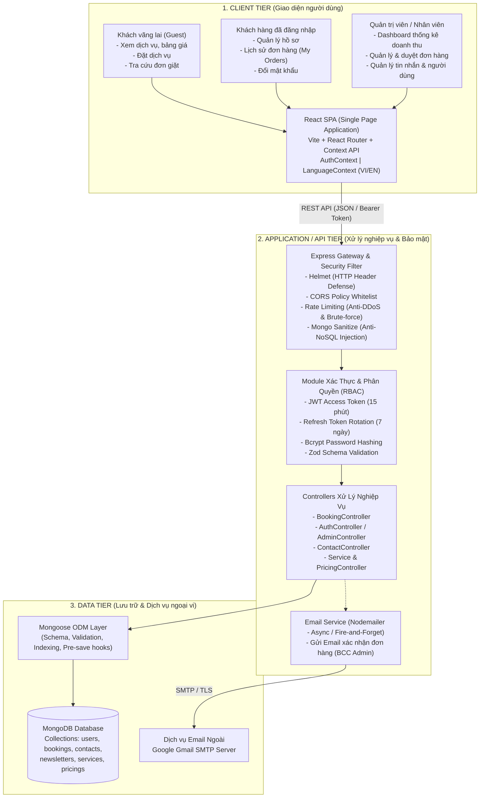
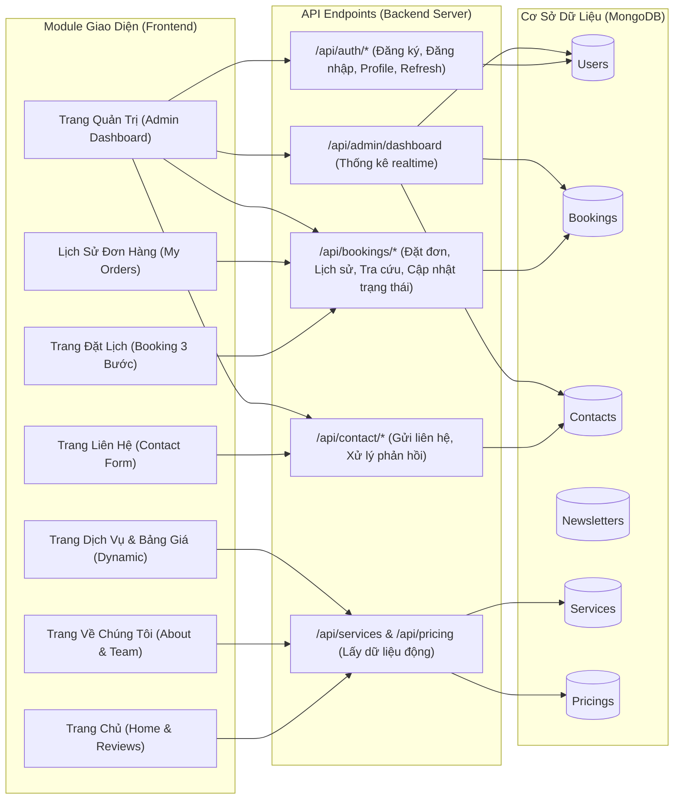
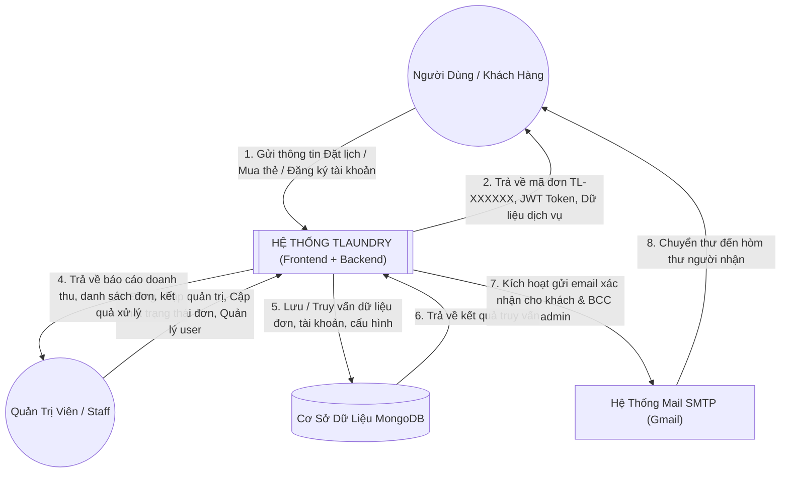

# 🏗️ SƠ ĐỒ TỔNG QUAN HỆ THỐNG (SYSTEM ARCHITECTURE)

Tài liệu này đặc tả kiến trúc tổng thể, mô hình phân tầng và tương tác giữa các thành phần trong hệ thống **TLaundry**.

---

## 1. Kiến Trúc 3 Tầng (3-Tier Architecture)

Hệ thống được thiết kế theo mô hình 3 tầng độc lập, giao tiếp thông qua giao thức an toàn `HTTPS / RESTful API JSON`:

---

## 2. Sơ Đồ Khối Chức Năng Của Hệ Thống (Functional Block Diagram)

---

## 3. Sơ Đồ Luồng Dữ Liệu Cấp Cao (Data Flow Diagram - DFD Level 0)

---

## 4. Mô Hình Phân Quyền Theo Vai Trò (RBAC Matrix)

Hệ thống thiết lập 3 vai trò rõ ràng với các đặc quyền truy cập:

| Chức Năng / API | Khách Vãng Lai (Guest) | Khách Hàng (CUSTOMER) | Nhân Viên (STAFF) | Quản Trị Viên (ADMIN) |
| :--- | :---: | :---: | :---: | :---: |
| Xem Trang chủ, Dịch vụ, Bảng giá | ✅ | ✅ | ✅ | ✅ |
| Đặt đơn giặt ủi (`POST /api/bookings`) | ✅ | ✅ (Tự động gán `userId`) | ✅ | ✅ |
| Tra cứu đơn công khai (`/api/bookings/:code/track`) | ✅ | ✅ | ✅ | ✅ |
| Gửi liên hệ (`POST /api/contact`) | ✅ | ✅ | ✅ | ✅ |
| Đăng ký / Đăng nhập tài khoản | ✅ | ✅ | ✅ | ✅ |
| Xem lịch sử đơn của mình (`/api/bookings/my-orders`) | ❌ | ✅ | ✅ | ✅ |
| Cập nhật hồ sơ & Đổi mật khẩu cá nhân | ❌ | ✅ | ✅ | ✅ |
| Xem toàn bộ đơn hàng (`GET /api/bookings`) | ❌ | ❌ | ✅ | ✅ |
| Đổi trạng thái đơn giặt (`PUT /api/bookings/:id/status`) | ❌ | ❌ | ✅ | ✅ |
| Xem & Xử lý tin nhắn liên hệ (`/api/contact`) | ❌ | ❌ | ✅ | ✅ |
| Xem Dashboard thống kê doanh thu (`/api/admin/dashboard`) | ❌ | ❌ | ✅ | ✅ |
| Quản lý tài khoản người dùng (`GET /api/admin/users`) | ❌ | ❌ | ✅ | ✅ |
| Tạo tài khoản Staff/Admin mới (`POST /api/admin/users`) | ❌ | ❌ | ❌ | ✅ |
| Khoá / Mở khoá tài khoản (`PUT /api/admin/users/:id/toggle-active`) | ❌ | ❌ | ❌ | ✅ |
