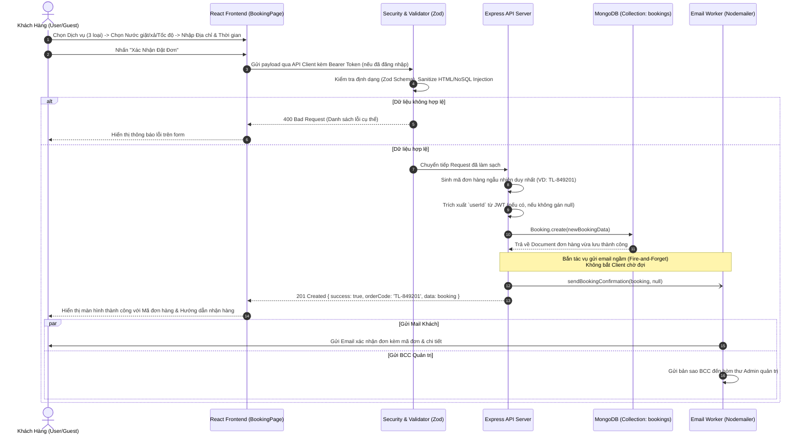
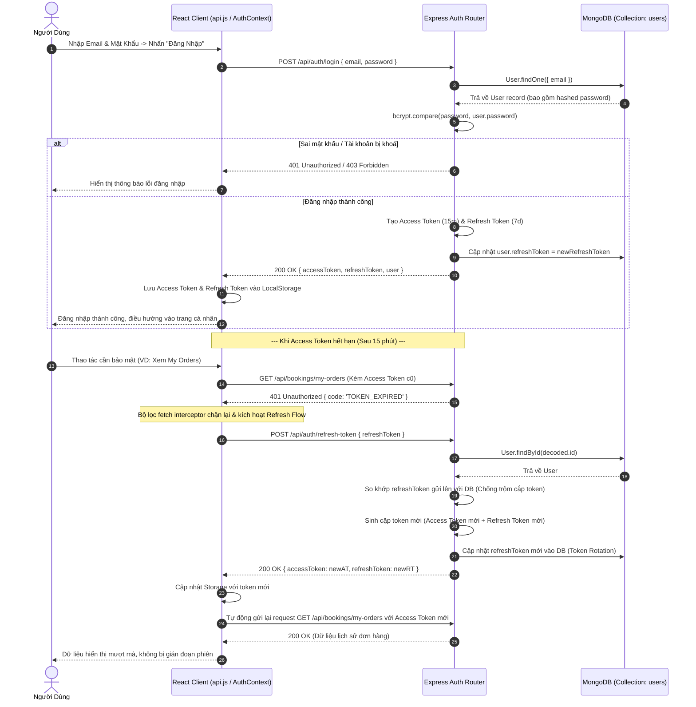
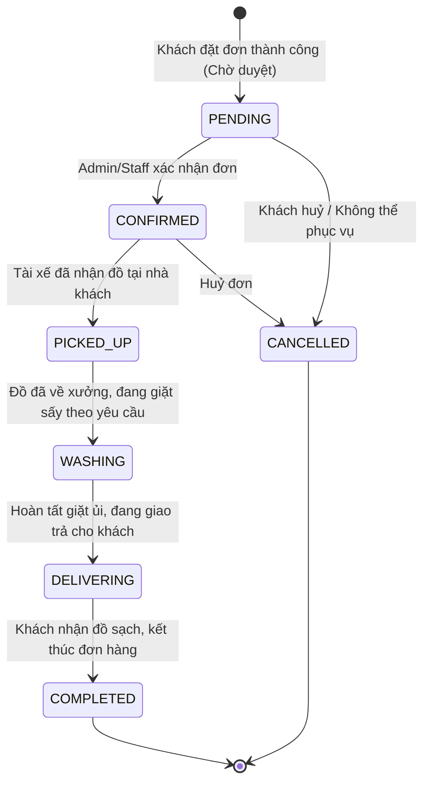
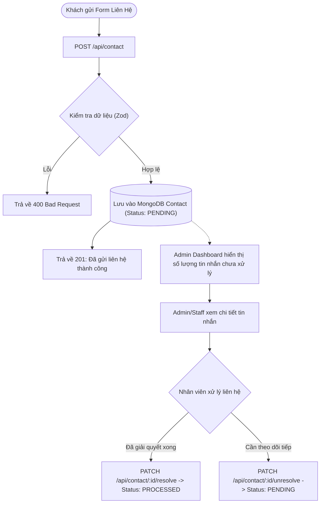

# 🔄 SƠ ĐỒ HOẠT ĐỘNG & TUẦN TỰ CHI TIẾT (WORKFLOWS & SEQUENCE DIAGRAMS)

Tài liệu này mô tả chi tiết các luồng nghiệp vụ quan trọng nhất của hệ thống **TLaundry** bằng sơ đồ tuần tự (Sequence Diagram) và sơ đồ chuyển đổi trạng thái (State Diagram).

---

## 1. Luồng Nghiệp Vụ Đặt Lịch Giặt Ủi (Booking Process)

Quy trình khách hàng đặt lịch dịch vụ trực tuyến, xác thực dữ liệu qua Zod, lưu vào MongoDB và gửi email thông báo tự động (Asynchronous):

---

## 2. Luồng Xác Thực Kép & Làm Mới Token Tự Động (JWT & Refresh Token Rotation)

Hệ thống sử dụng cơ chế bảo mật xác thực 2 tầng:
- **Access Token:** Hạn sử dụng ngắn (15 phút), dùng để gọi API được bảo vệ.
- **Refresh Token:** Hạn sử dụng 7 ngày, lưu mã hóa trong MongoDB, tự động cấp mới (Rotation) khi Access Token hết hạn:

---

## 3. Vòng Đời Trạng Thái Đơn Giặt (Booking State Machine)

Trạng thái đơn hàng được quản lý chặt chẽ theo tiến trình thực tế:

### Ý nghĩa từng trạng thái:
- **`PENDING` (Chờ xử lý):** Đơn mới khởi tạo, chờ nhân viên kiểm tra tuyến đường & lịch hẹn.
- **`CONFIRMED` (Đã xác nhận):** Đơn hợp lệ, đã phân công lịch hẹn nhận đồ.
- **`PICKED_UP` (Đã lấy hàng):** Đội ngũ shipper đã đến tận nhà lấy quần áo.
- **`WASHING` (Đang xử lý/giặt sấy):** Quần áo đang trong quy trình phân loại, tẩy điểm, giặt sấy sinh học hoặc giặt khô.
- **`DELIVERING` (Đang giao hàng):** Quần áo đã thơm tho, đóng gói cẩn thận và đang trên đường giao trả.
- **`COMPLETED` (Đã hoàn tất):** Giao hàng thành công.
- **`CANCELLED` (Đã huỷ):** Đơn hàng bị huỷ theo yêu cầu hoặc lỗi giao tiếp.

---

## 4. Luồng Xử Lý Tin Nhắn Liên Hệ & Khiếu Nại (Contact Pipeline)

