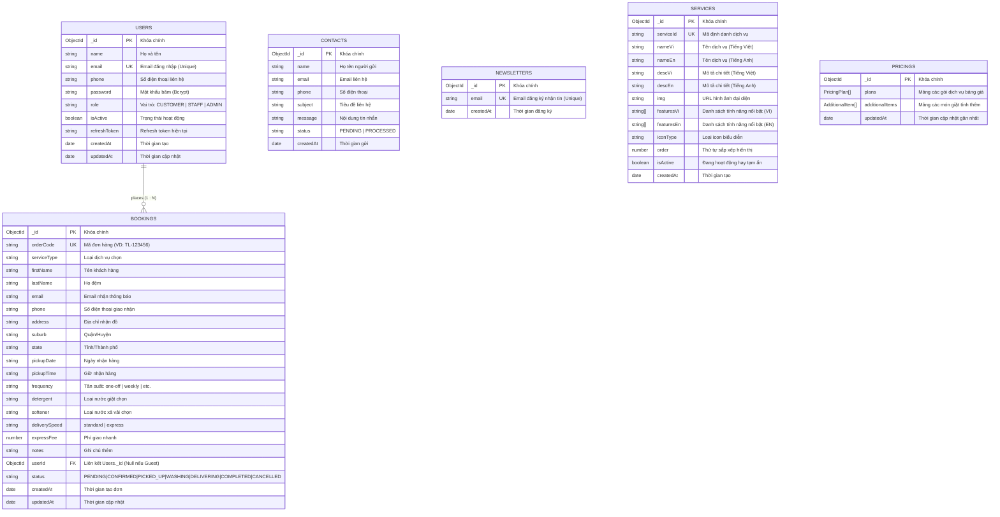

# 🗄️ SƠ ĐỒ CƠ SỞ DỮ LIỆU & THỰC THỂ QUAN HỆ (ERD - DATABASE SCHEMA)

Tài liệu này đặc tả chi tiết toàn bộ mô hình dữ liệu (Database Schema), sơ đồ quan hệ thực thể (Entity Relationship Diagram - ERD) và từ điển dữ liệu của hệ thống **TLaundry** (sử dụng MongoDB & Mongoose ODM).

---

## 1. Sơ Đồ Quan Hệ Thực Thể (Entity Relationship Diagram - ERD)



---

## 2. Chi Tiết Cấu Trúc Các Collections (Data Dictionary)

### 2.1. Collection: `users`
Lưu trữ thông tin người dùng, bao gồm Khách hàng, Nhân viên và Quản trị viên.

| Tên Trường (Field) | Kiểu Dữ Liệu | Ràng Buộc | Giá Trị Mặc Định | Mô Tả |
| :--- | :--- | :--- | :--- | :--- |
| `_id` | `ObjectId` | PK, Auto | Auto generated | Mã định danh duy nhất của người dùng |
| `name` | `String` | Required, Trim | - | Họ và tên đầy đủ |
| `email` | `String` | Required, Unique, Lowercase | - | Địa chỉ email dùng để đăng nhập |
| `phone` | `String` | Optional, Trim | `''` | Số điện thoại liên hệ |
| `password` | `String` | Required | - | Mật khẩu đã băm (Bcrypt 10 rounds) |
| `role` | `String` | Enum | `'CUSTOMER'` | Vai trò: `CUSTOMER`, `STAFF`, `ADMIN` |
| `isActive` | `Boolean` | Required | `true` | Trạng thái kích hoạt (Admin có thể khóa) |
| `refreshToken` | `String` | Nullable | `null` | Refresh Token hiện tại (hỗ trợ Token Rotation) |
| `createdAt` | `Date` | Auto | `Date.now` | Thời điểm tạo tài khoản |
| `updatedAt` | `Date` | Auto | - | Thời điểm cập nhật cuối cùng |

---

### 2.2. Collection: `bookings`
Lưu trữ toàn bộ đơn đặt dịch vụ giặt ủi của khách hàng.

| Tên Trường (Field) | Kiểu Dữ Liệu | Ràng Buộc | Giá Trị Mặc Định | Mô Tả |
| :--- | :--- | :--- | :--- | :--- |
| `_id` | `ObjectId` | PK, Auto | Auto generated | Mã định danh đơn hàng trong MongoDB |
| `orderCode` | `String` | Required, Unique | - | Mã đơn hàng công khai (VD: `TL-829104`) |
| `serviceType` | `String` | Required | `'Giặt Ủi Gia Đình'` | Loại dịch vụ khách đã chọn |
| `firstName` | `String` | Required | - | Tên khách hàng |
| `lastName` | `String` | Required | - | Họ đệm của khách hàng |
| `email` | `String` | Required | - | Email nhận biên nhận & thông báo đơn |
| `phone` | `String` | Required | - | Số điện thoại liên hệ giao nhận |
| `address` | `String` | Required | - | Địa chỉ chi tiết nhận & trả đồ |
| `suburb` | `String` | Optional | `''` | Quận / Huyện / Khu vực |
| `state` | `String` | Optional | `''` | Tỉnh / Thành phố |
| `pickupDate` | `String` | Optional | `''` | Ngày hẹn shipper đến lấy hàng |
| `pickupTime` | `String` | Optional | `''` | Khung giờ hẹn shipper đến lấy hàng |
| `frequency` | `String` | Optional | `'one-off'` | Tần suất giặt (đơn lẻ hoặc định kỳ) |
| `detergent` | `String` | Optional | Sinh học | Loại nước giặt khách chọn |
| `softener` | `String` | Optional | Lavender | Loại nước xả vải khách chọn |
| `deliverySpeed`| `String` | Enum | `'standard'` | Tốc độ: `standard` (tiêu chuẩn), `express` (giao nhanh) |
| `expressFee` | `Number` | Optional | `0` | Phụ phí giao nhanh (nếu chọn express) |
| `notes` | `String` | Optional | - | Ghi chú đặc biệt cho tài xế/tiệm |
| `userId` | `ObjectId` | FK -> `users._id` | `null` | Khóa ngoại trỏ đến User (null nếu khách vãng lai) |
| `status` | `String` | Enum | `'PENDING'` | Trạng thái đơn: `PENDING`, `CONFIRMED`, `PICKED_UP`, `WASHING`, `DELIVERING`, `COMPLETED`, `CANCELLED` |
| `createdAt` | `Date` | Auto | `Date.now` | Thời điểm đặt đơn |
| `updatedAt` | `Date` | Auto | - | Thời điểm cập nhật trạng thái đơn |

---

### 2.3. Collection: `contacts`
Lưu trữ thông tin liên hệ và tin nhắn khiếu nại/tư vấn từ khách hàng.

| Tên Trường (Field) | Kiểu Dữ Liệu | Ràng Buộc | Giá Trị Mặc Định | Mô Tả |
| :--- | :--- | :--- | :--- | :--- |
| `_id` | `ObjectId` | PK, Auto | Auto generated | Khóa chính |
| `name` | `String` | Required | - | Tên người gửi liên hệ |
| `email` | `String` | Required | - | Email phản hồi |
| `phone` | `String` | Optional | - | Số điện thoại người gửi |
| `subject` | `String` | Optional | - | Tiêu đề tin nhắn |
| `message` | `String` | Required | - | Nội dung cần hỗ trợ / phản ánh |
| `status` | `String` | Enum | `'PENDING'` | Trạng thái xử lý: `PENDING`, `PROCESSED` |
| `createdAt` | `Date` | Auto | `Date.now` | Thời điểm gửi |

---

### 2.4. Collection: `newsletters`
Lưu trữ danh sách email đăng ký nhận bản tin khuyến mãi.

| Tên Trường (Field) | Kiểu Dữ Liệu | Ràng Buộc | Mô Tả |
| :--- | :--- | :--- | :--- |
| `_id` | `ObjectId` | PK, Auto | Khóa chính |
| `email` | `String` | Required, Unique, Lowercase | Email đăng ký nhận ưu đãi |
| `createdAt` | `Date` | Auto | Thời điểm đăng ký |

---

### 2.5. Collection: `services`
Quản lý động danh sách các gói dịch vụ giặt ủi hiển thị trên website.

| Tên Trường (Field) | Kiểu Dữ Liệu | Ràng Buộc | Mô Tả |
| :--- | :--- | :--- | :--- |
| `_id` | `ObjectId` | PK, Auto | Khóa chính |
| `serviceId` | `String` | Required, Unique | Mã định danh dạng slug (VD: `domestic-laundry`) |
| `nameVi` / `nameEn` | `String` | Required | Tên dịch vụ song ngữ (Việt - Anh) |
| `descVi` / `descEn` | `String` | Required | Đoạn văn mô tả dịch vụ song ngữ |
| `img` | `String` | Required | Đường dẫn ảnh minh họa Unsplash/Cloudinary |
| `featuresVi` / `featuresEn` | `[String]` | Array | Danh sách các gạch đầu dòng tính năng |
| `iconType` | `String` | Default: `'laundry'` | Loại biểu tượng |
| `order` | `Number` | Default: `0` | Thứ tự ưu tiên hiển thị |
| `isActive` | `Boolean` | Default: `true` | Trạng thái hiển thị |

---

### 2.6. Collection: `pricings`
Quản lý bảng giá động của toàn hệ thống (Gồm các gói chính `plans` và món phụ `additionalItems`).

```json
{
  "_id": "ObjectId",
  "plans": [
    {
      "planId": "standard-wash",
      "nameVi": "Giặt Sấy Tiêu Chuẩn",
      "nameEn": "Standard Wash & Fold",
      "noteVi": "Tối thiểu 5kg",
      "noteEn": "Min 5kg",
      "featured": true,
      "featuresVi": ["Nước giặt sinh học", "Giao nhận 24h"],
      "featuresEn": ["Bio detergent", "24h delivery"],
      "iconType": "domestic",
      "order": 1
    }
  ],
  "additionalItems": [
    {
      "itemId": "ironing-shirt",
      "nameVi": "Là/Ủi Sơ Mi Cao Cấp",
      "nameEn": "Premium Shirt Ironing",
      "priceVi": "25.000đ / cái",
      "priceEn": "$2.5 / piece",
      "order": 1
    }
  ],
  "updatedAt": "Date"
}
```
