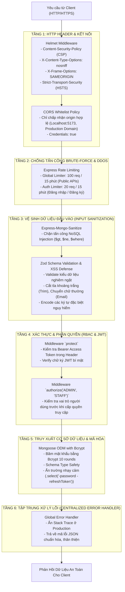
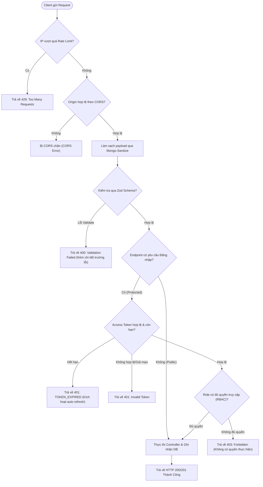

# 🛡️ SƠ ĐỒ KIẾN TRÚC BẢO MẬT & LUỒNG TRUY CẬP (SECURITY ARCHITECTURE)

Tài liệu này đặc tả cơ chế bảo mật đa tầng (Defense in Depth) được triển khai trên hệ thống **TLaundry**, giúp ngăn chặn các lỗ hổng OWASP Top 10 phổ biến như XSS, CSRF, NoSQL Injection, Brute-Force, Token Theft, và Data Leakage.

---

## 1. Sơ Đồ Các Tầng Bảo Vệ (Multi-Layer Security Architecture)

---

## 2. Luồng Kiểm Tra & Xử Lý Một Request Vào Hệ Thống

---

## 3. Các Biện Pháp Bảo Mật Trọng Điểm Đã Triển Khai

| STT | Biện Pháp Bảo Mật | Công Nghệ / Thư Viện | Mục Đích Bảo Vệ |
| :---: | :--- | :--- | :--- |
| **1** | **HTTP Security Headers** | `helmet` | Chống Clickjacking, MIME-sniffing, XSS qua header trình duyệt. |
| **2** | **CORS Whitelist** | `cors` | Giới hạn chỉ tên miền frontend được phép gọi API. |
| **3** | **Chống Brute-Force & DoS** | `express-rate-limit` | Giới hạn 20 lần thử login/15 phút nhằm vô hiệu hóa tấn công dò pass. |
| **4** | **Chống NoSQL Injection** | `express-mongo-sanitize` | Loại bỏ các toán tử MongoDB độc hại (`$where`, `$gt`) khỏi request body/params. |
| **5** | **Xác thực Schema chặt chẽ** | `zod` | Đảm bảo kiểu dữ liệu, định dạng email, độ dài mật khẩu và loại bỏ dữ liệu rác. |
| **6** | **Xác thực kép Access + Refresh**| `jsonwebtoken (JWT)` | Access Token sống ngắn (15p) giảm thiểu rủi ro khi bị chặn bắt, Refresh Token hỗ trợ duy trì đăng nhập an toàn. |
| **7** | **Băm mật khẩu một chiều** | `bcryptjs` (10 rounds) | Đảm bảo mật khẩu không bao giờ bị lộ kể cả khi Database bị truy cập trái phép. |
| **8** | **Cơ chế Env Guard & Leak Defense** | Code tự phát triển trong `server.js` | Tự động crash server nếu phát hiện dùng chuỗi secret yếu hoặc bị lộ công khai trên Git. |
| **9** | **Xử lý lỗi tập trung an toàn** | `errorHandler.js` | Che giấu chi tiết lỗi hệ thống (Database stack trace), ngăn rò rỉ thông tin nhạy cảm. |
